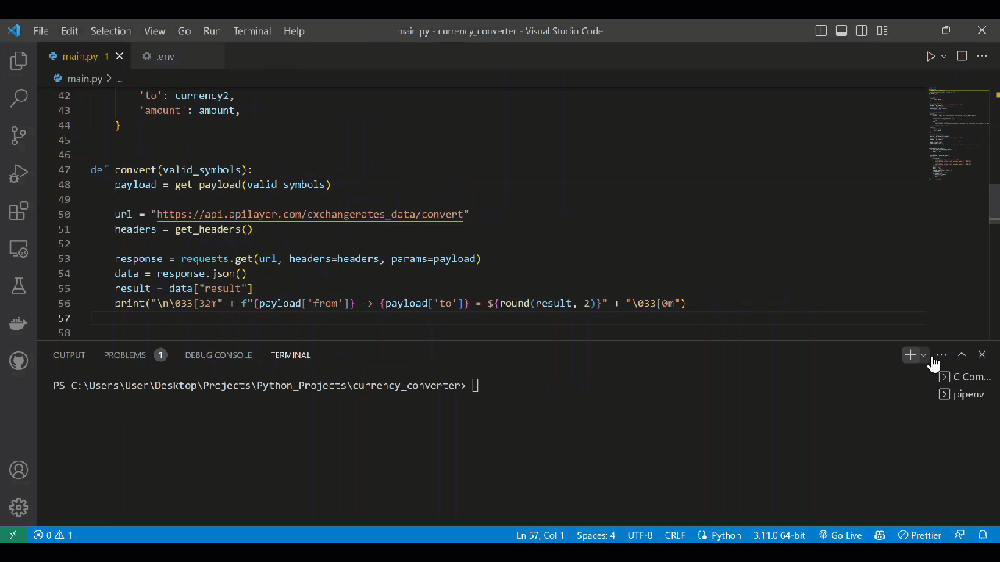

# Currency Converter

> This is a currency converter. You have the following options:

1. List of all currency codes and symbols
2. Convert currency
3. Exit





## Usage

#
1: Install the dependencies:

```bash
pipenv install -r requirements.txt 
```

#
2: 
- Rename '.env_sample' to '.env'
- Add your API key to the .env file
- You can get your key at [Fixer.io](Fixer.io)

```bash
API ='ADD_YOUR_KEY_HERE'
```

#
3: Run server:

```bash
python main.py
```


## License
MIT © iAlex0

